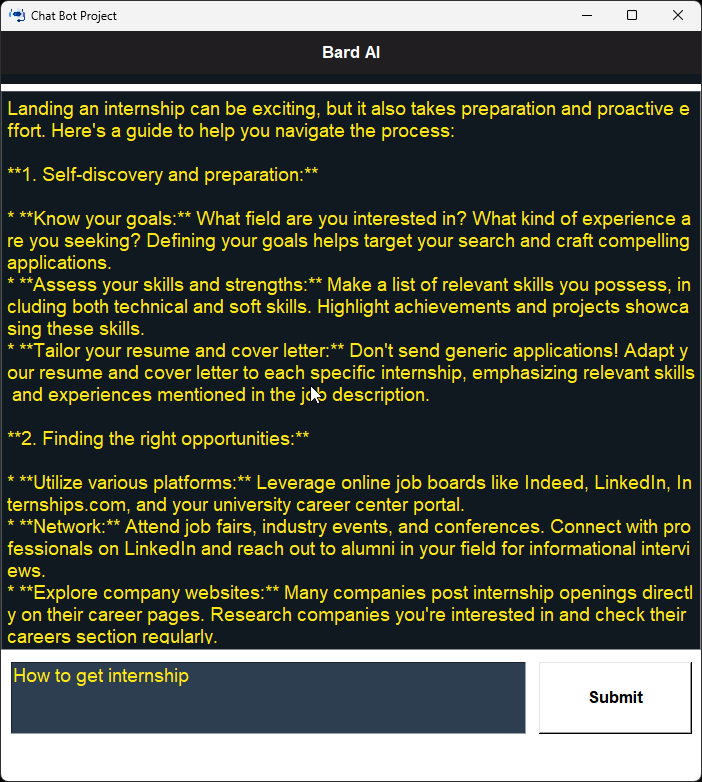

# BardAi_ChatBot
# Chat Bot Project

## Overview
This project is a real-time, interactive chatbot powered by Tkinter and BardAPI. It offers dynamic responses and an enhanced user experience. It's open-source and easy to integrate, making it a perfect tool for those seeking real-time assistance.

## Features
- Real-time interaction: Engage in conversations with the chatbot and receive responses in real time.
- Dynamic responses: The chatbot provides dynamic responses based on the user's input.
- Enhanced user experience: The chatbot interface is user-friendly and easy to navigate.

## Libraries Used
- Tkinter: Used for creating the GUI for the chatbot.
- BardAPI: Powers the chatbot to generate dynamic responses.

## Getting Started
1. Clone the repository: `git clone https://github.com/yourusername/chatbot-project.git`
2. Install the dependencies: `pip install -r requirements.txt`
3. Run the chatbot: `python main.py`

## Contributing
We welcome contributions! Please see our contributing guidelines for more details.

## License
This project is licensed under the MIT License. See the LICENSE file for details.

